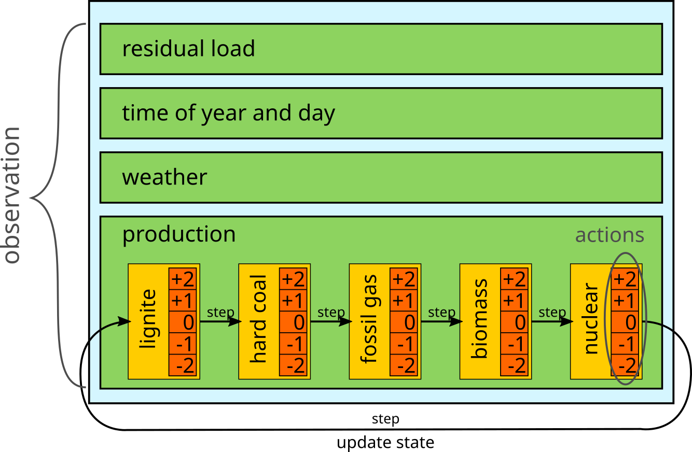
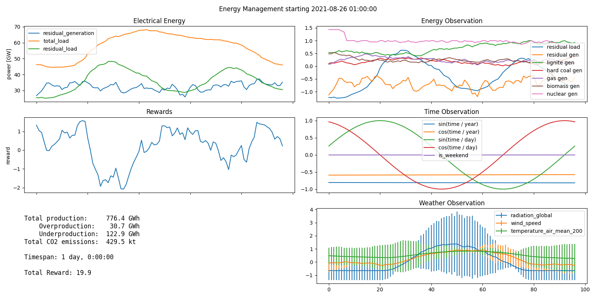

# Energy Management Gym

OpenAI Gym compatible environment that simulates the control of different
types of power plants by the agent. The reward depends on the total CO2 output of all
power plants and the deviation from the so-called residual load. The residual load is
the power output of renewable energy sources subtracted from the total load on the grid.
Data for all power grid and weather related information corresponds to the real
world data from Germany between 2015 and 2021.

## Description
<p align="center">
  
</p>

This environment allows an agent to control the power output of different sources (lignite, hard coal, fossil gas, biomass and nuclear) with the goal to meet the residual load, which is the total grid load minus output of wind and solar.

The observations of load and weather are read from a database of real-world data of Germany from 2015-2021.
Energy production is simulated by using one 'plant' per
source and summing their outputs.
The plant models include co2-characteristics, delays, power-on time and total capacity.

The plants are controlled one at a time and only after all plants have been adjusted does the environment advance to the next time-step.

Looking at the environment after running a random policy for an episode with `env.render()`:



## Installation
We use [anaconda](https://www.anaconda.com/products/individual) to manage dependencies.
```bash
conda env create -f environment.yml  # may take a while
conda activate energy-gym
export PYTHONPATH=.
```

Now run the scripts from the projects root directory, e.g.:
```bash
python src/probing/random_agent.py
```


## Agents
To get a general idea of the environment, take a look at what the random agent does:
```bash
python src/probing/random_agent.py
```

### Train and evaluate
To probe the environment, first train an agent for 100000 steps with
```bash
python src/probing/smart_agent.py -a train -s 100000
```
and then evaluate the result after step 100000 by looking at sampled episodes with
```bash
python src/probing/smart_agent.py -a show -s 100000
```
To run pre-defined experiment number n, type
```bash
python src/probing/smart_agent.py -m auto -e <n> -a train
```
For a list of all options type
```bash
python src/probing/smart_agent.py --help
```

### Monitor training progress
Training may take some time and the final agent may not be the best one yet.
Use tensorboard to monitor the reward over time.
The current logging directory will be printed to the console, i.e.
```bash
Logging to tensorboard_logs/auto/1/42/PPO_0
```
To run tensorboard, type
```bash
tensorboard --logdir=<LOGDIR>
```

## Data sources
* German electrical grid load, consumption and installed capacity: [Bundesnetzagentur](https://www.bundesnetzagentur.de/), aquired using platform [smard](https://www.smard.de/en/downloadcenter/download-market-data)
* German weather: [Deutscher Wetterdienst](https://www.dwd.de/), aquired using the third party python library [wetterdienst](https://github.com/earthobservations/wetterdienst)
* Information on Emissions: [Umweltbundesamt](https://www.umweltbundesamt.de/sites/default/files/medien/1410/publikationen/171207_uba_hg_braunsteinkohle_bf.pdf)
* Power plant reaction times: [BDI](https://web.archive.org/web/20150923183021/http://www.bdi.eu/download_content/EnergieUndRohstoffe/Hundt16022010.pdf)